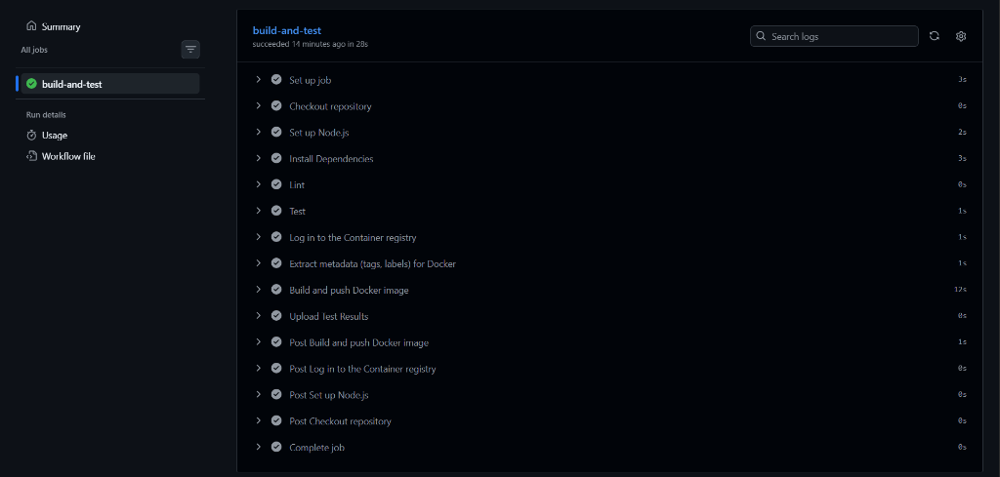
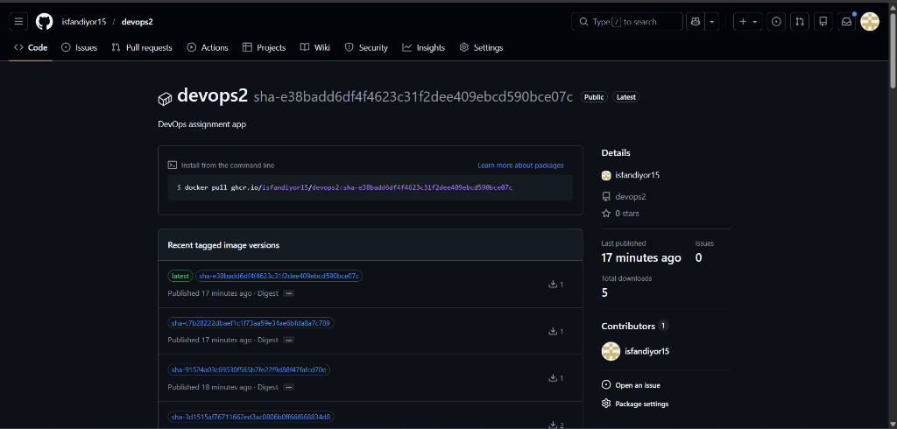
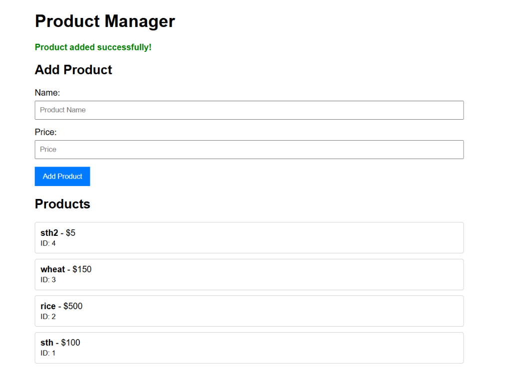
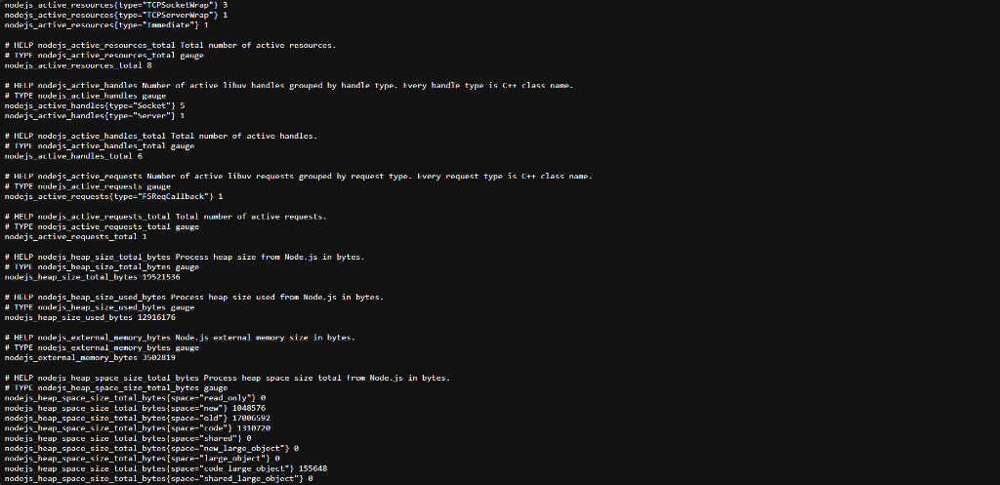
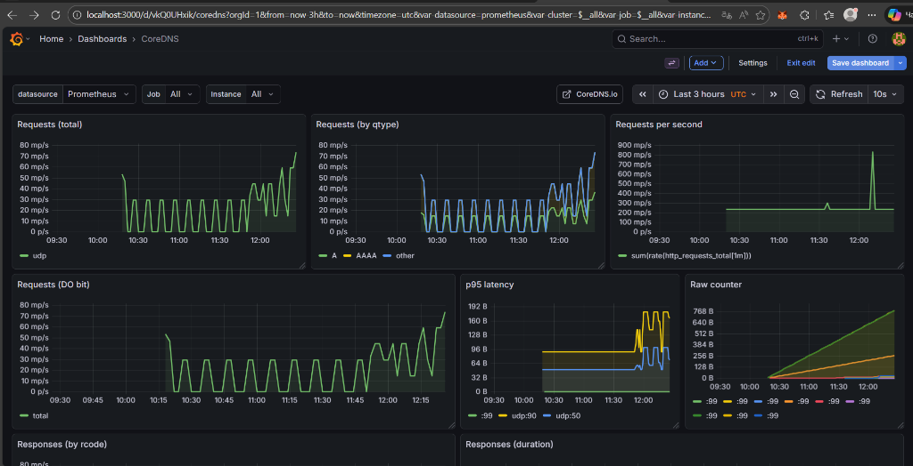
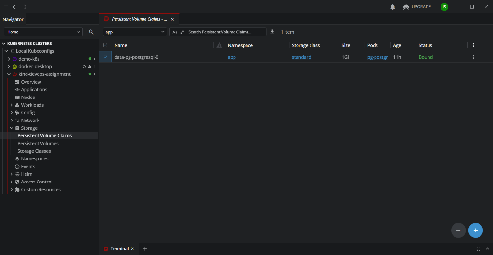
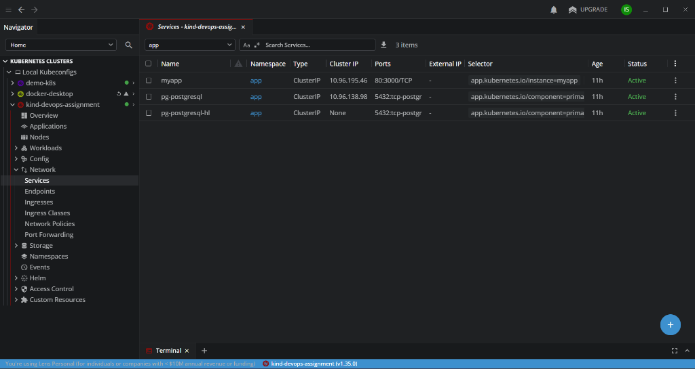
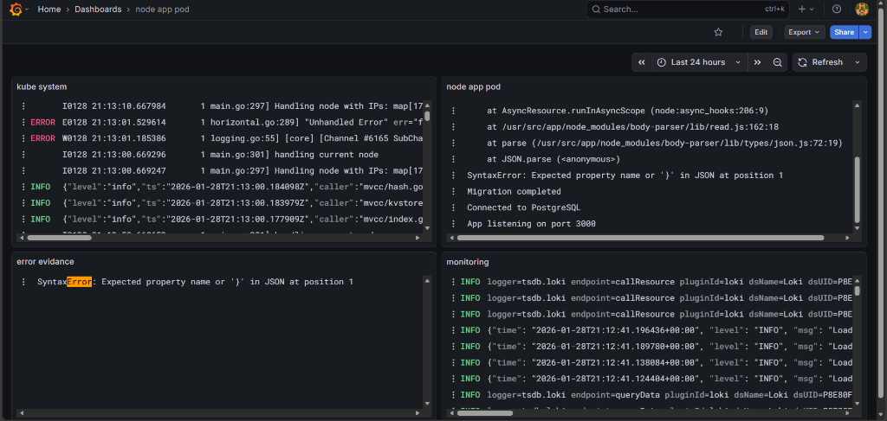

# DevOps 2 Project Evidence

## Reproduction Steps

### 1. Requirements
- Docker
- Kind
- Helm
- Kubectl

### 2. Cluster Setup
```powershell
kind create cluster --name devops-assignment
kubectl get nodes
```

### 3. Install Monitoring (Prometheus + Grafana)
```powershell
kubectl create ns monitoring
helm repo add prometheus-community https://prometheus-community.github.io/helm-charts
helm repo update
helm upgrade --install kps prometheus-community/kube-prometheus-stack -n monitoring --wait
```

### 4. Install PostgreSQL
```powershell
kubectl create ns app
helm repo add bitnami https://charts.bitnami.com/bitnami
helm repo update
helm upgrade --install pg bitnami/postgresql -n app -f infra/db/values-postgres.yaml --wait
```

### 5. Deploy Application
```powershell
# Using the Helm Chart
helm upgrade --install myapp ./helm/myapp -n app --wait
```

### 6. Verify Deployment
```powershell
kubectl get pods -n app
```

### 7. Port Forwarding & Access
**App:**
```powershell
kubectl port-forward svc/myapp 8080:80 -n app
```
Access: http://localhost:8080

**Grafana:**
```powershell
# Get Password:
kubectl -n monitoring get secret kps-grafana -o jsonpath="{.data.admin-password}" | base64 -d
# Port Forward:
kubectl -n monitoring port-forward svc/kps-grafana 3000:80
```
Access: http://localhost:3000 (User: `admin`)

**Prometheus (optional):**
```powershell
kubectl port-forward svc/kps-kube-prometheus-stack-prometheus 9090:9090 -n monitoring
```
Access: http://localhost:9090

## Verification Checks

### Curl Checks
```powershell
curl http://localhost:8080/healthz
curl http://localhost:8080/readyz
curl http://localhost:8080/products
# Add Product
curl -X POST http://localhost:8080/products -H "Content-Type: application/json" -d "{\"name\":\"test\",\"price\":12.5}"
# Verify Persistence (Restart pod and check again)
kubectl -n app delete pod -l app=myapp
curl http://localhost:8080/products
```

### Prometheus Queries
Use these in Grafana Explore or Prometheus UI:
- **RPS**: `sum(rate(http_requests_total[1m]))`
- **Error Rate**: `sum(rate(http_requests_total{status_code=~"5.."}[5m]))`
- **P95 Latency**: `histogram_quantile(0.95, sum(rate(http_request_duration_seconds_bucket[5m])) by (le))`
- **App Target Status**: `up{job="myapp"}`

## Manual Evidence Checklist
User must capture screenshots of:
1. [x] **GitHub Actions**: Green run for `build-and-test`.
   
2. [x] **GHCR Packages**: Package page showing `latest` and `sha` tags.
   
3. [x] **Browser UI**: `http://localhost:8080` showing products list.
   
4. [x] **Metrics**: `http://localhost:8080/metrics` output containing `http_requests_total`.
   
5. [x] **Grafana Explore**: Query results for RPS, Error Rate, and P95 Latency.
   
6. [x] **Lens/Kubectl**: Showing `pg-postgresql` StatefulSet (Ready) and `myapp` Pods (Running).
   
   
   

## Manual GitHub Setting
- Go to **GitHub -> Profile -> Packages -> devops2 -> Package settings**.
- Ensure visibility is **Public**.
- Click **"Connect Repository"** and select `devops2`.

## Logging with Loki

### 1. Installation
```powershell
# Add Repo
helm repo add grafana https://grafana.github.io/helm-charts
helm repo update
kubectl create ns logging

# Install Loki (using loki-stack for simplicity)
helm upgrade --install loki grafana/loki-stack -n logging --set promtail.enabled=false --set loki.persistence.enabled=false --set loki.auth_enabled=false --wait

# Install Promtail
helm upgrade --install promtail grafana/promtail -n logging --set "config.clients[0].url=http://loki.logging.svc.cluster.local:3100/loki/api/v1/push" --wait
```

### 2. Configure Grafana Datasource
Loki datasource is provisioned via ConfigMap in `monitoring` namespace.
```powershell
# Verify Datasource ConfigMap
kubectl get cm -n monitoring grafana-loki-datasource
```

### 3. Verify Logging
```powershell
# Check Pods
kubectl get pods -n logging

# Check Promtail Logs
kubectl -n logging logs deploy/promtail --tail=80
```

### 4. Grafana Access
```powershell
# Port Forward
kubectl -n monitoring port-forward svc/kps-grafana 3000:80

# Get Password
$pwdB64 = kubectl -n monitoring get secret kps-grafana -o jsonpath="{.data.admin-password}"
[Text.Encoding]::UTF8.GetString([Convert]::FromBase64String($pwdB64))
```

### 5. Manual Evidence (Loki)
User must capture screenshots of:
1. [x] **Grafana Explore**: Select `Loki` datasource.
2. [x] **Log Query**: Run `{app="myapp"}` or `{namespace="app"}` to see logs.
   

## GitOps (ArgoCD) Evidence

### 1. Installation & Status
```powershell
# Check ArgoCD Components
kubectl get pods -n argocd
```

### 2. Verify Application Sync
```powershell
# Check Application Status
kubectl get application -n argocd devops2-app
```
Expected Output: `SYNC STATUS: Synced`, `HEALTH STATUS: Healthy`.

### 3. CI/CD Loop Evidence
1.  **GitHub Action** builds and pushes image (tag: `sha-xxxx`).
2.  **GitHub Action** commits `sha-xxxx` to `helm/myapp/values.yaml`.
3.  **ArgoCD** detects change and updates deployment.

### 4. Manual Evidence
User must capture screenshots of:
1. [x] **ArgoCD Pods**: `kubectl get pods -n argocd` (All Running).
   
2. [x] **ArgoCD App Status**: `kubectl get application -n argocd` (Healthy).
   